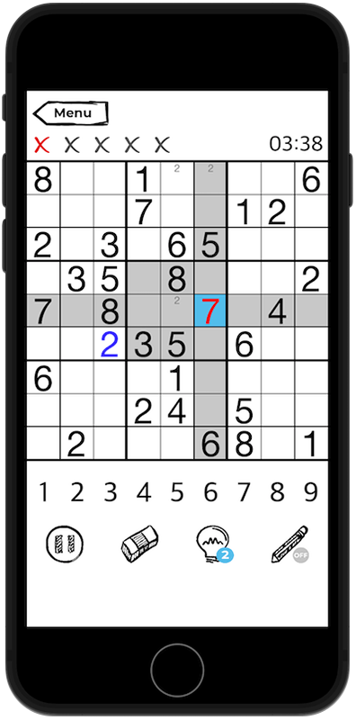

###  __MySudokuProject__
This is a popular puzzle game with three difficulty levels. The sudoku generator creates unique levels based on the selected difficulty level. The game can be paused and it also has automatic saving.
###### Application stack:
* UIKit (code)
* Clean Swift
* Core Data
***
###  __Preview__

***
###  __Feedback__
Telegram - @Sa1monch  
Email - sadyrevdimon@icloud.com
